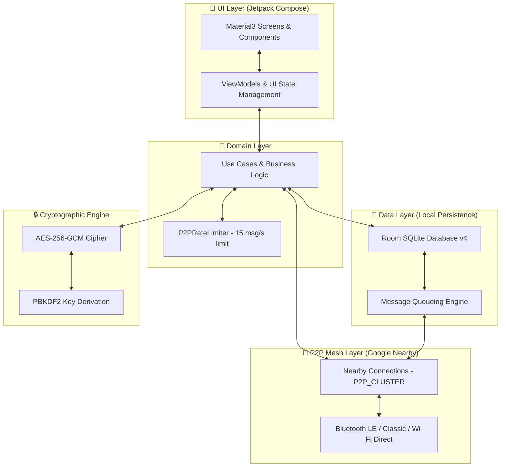

<p align="center">
  
</p>

<h1 align="center">P2Chat</h1>

<p align="center">
  <strong>Decentralized, Serverless & Offline Peer-to-Peer Mesh Messenger for Android</strong>
</p>

<p align="center">
  <a href="https://github.com/AmritRai1234/P2Chat/blob/main/LICENSE">
    
  </a>
  <a href="https://developer.android.com/">
    
  </a>
  <a href="https://kotlinlang.org/">
    
  </a>
  <a href="https://developer.android.com/jetpack/compose">
    
  </a>
  <a href="#">
    
  </a>
  <a href="#">
    
  </a>
  <a href="https://AmritRai1234.github.io/P2Chat/">
    
  </a>
</p>

<p align="center">
  <a href="#-key-features">Key Features</a> •
  <a href="#%EF%B8%8F-architecture--tech-stack">Architecture</a> •
  <a href="#%EF%B8%8F-security-architecture--threat-model">Security</a> •
  <a href="#-mesh-networking-protocol">Mesh Protocol</a> •
  <a href="#-building--running">Getting Started</a> •
  <a href="#-license">License</a>
</p>

---

> [!IMPORTANT]
> **Zero Infrastructure Required.** P2Chat operates completely off-grid with **zero cellular data, zero central servers, zero cloud dependency, and zero metadata collection**. Designed for emergency resilience, off-grid expeditions, privacy-focused communications, and serverless mesh networking.

---

## 📋 Table of Contents

- [🌟 Overview](#-overview)
- [🔥 Key Features](#-key-features)
- [🛠️ Architecture & Tech Stack](#%EF%B8%8F-architecture--tech-stack)
  - [High-Level Data Flow](#high-level-data-flow)
  - [Technology Stack Matrix](#technology-stack-matrix)
- [🛡️ Security Architecture & Threat Model](#%EF%B8%8F-security-architecture--threat-model)
  - [Cryptographic Primitives](#cryptographic-primitives)
  - [Threat Vector Mitigation Matrix](#threat-vector-mitigation-matrix)
- [📡 Mesh Networking Protocol](#-mesh-networking-protocol)
  - [Multi-Hop Packet Routing](#multi-hop-packet-routing)
- [⚡ Footprint & Size Optimization](#-footprint--size-optimization)
- [📁 Codebase Directory Structure](#-codebase-directory-structure)
- [🚀 Building & Running](#-building--running)
  - [Prerequisites](#prerequisites)
  - [Build Commands](#build-commands)
  - [Device Installation](#device-installation)
- [🌐 Web Companion & Demo](#-web-companion--demo)
- [🤝 Contributing](#-contributing)
- [📄 License](#-license)

---

## 🌟 Overview

**P2Chat** is a 100% serverless, zero-internet peer-to-peer mesh messaging application engineered natively for Android. It bridges nearby smartphones into a decentralized multi-hop ad-hoc network utilizing **Bluetooth Low Energy (BLE), Bluetooth Classic, and Wi-Fi Direct** via Google Nearby Connections (`P2P_CLUSTER` strategy).

Whether in underground subways, disaster recovery zones, wilderness trails, or crowded event stadiums, P2Chat ensures instantaneous, encrypted, and resilient peer-to-peer communication without relying on ISP infrastructure or cellular towers.

🌐 **Live Website & Interactive Demo**: [https://AmritRai1234.github.io/P2Chat/](https://AmritRai1234.github.io/P2Chat/)

---

## 🔥 Key Features

| Feature | Description |
| :--- | :--- |
| 📡 **Zero-Internet P2P Mesh Network** | Multi-hop peer relay powered by Google Nearby Connections (`P2P_CLUSTER`). Messages dynamically hop across nearby devices to reach out-of-range recipients. |
| 🔒 **AES-256-GCM End-to-End Encryption** | Zero-trust payload security with 128-bit authentication tags and unique 12-byte IVs per packet. Group keys derived via `PBKDF2WithHmacSHA256`. |
| 💾 **Store-and-Forward Routing (Room v4)** | Persistent message queues stored in local SQLite database files. Messages targeting offline peers automatically flush over-the-air upon peer discovery. |
| ⚡ **Ultra-Compact 1.6 MB APK** | Heavily optimized footprint achieved via 5-pass R8 bytecode minification, resource stripping, WebP compression, and ABI split execution. |
| 📲 **Offline Self-Replication** | Extract running APK binary at runtime and stream `P2Chat.apk` over Nearby Connections to nearby devices without internet or Google Play access. |
| 📎 **100 MB High-Speed File Transfers** | Send photos, PDFs, videos, and arbitrary documents using high-speed zero-copy stream `FILE` payloads. |
| 📷 **Instant QR Code Invitations** | Generate 512x512 QR code bitmaps via ZXing for quick zero-click group joining, contact exchange, and app distribution. |
| 🎨 **Glassmorphic Material 3 Interface** | Sleek, modern UI built with Jetpack Compose featuring smooth dark & light theme switching and micro-animations. |

---

## 🛠️ Architecture & Tech Stack

P2Chat strictly adheres to **Clean Architecture** principles and the **MVVM (Model-View-ViewModel)** design pattern, split into well-defined software layers to maintain modularity, testability, and separation of concerns.

### High-Level Data Flow



### Technology Stack Matrix

- **Programming Language**: Kotlin `1.9+` (JVM Target 17)
- **UI Framework**: Jetpack Compose (Material Design 3, Compose Navigation, Glassmorphism design system)
- **Architecture**: MVVM + Clean Architecture (`ui`, `domain`, `data`, `nearby`, `crypto`, `service`, `di`)
- **Dependency Injection**: Hilt (Dagger) with KSP annotation processing
- **Local Persistence**: Room SQLite v4 (`messages`, `peers`, `groups`, `mesh_peers`, `message_queue`, `network_stats`)
- **Mesh Stack**: Google Play Services Nearby Connections API (`P2P_CLUSTER` topology)
- **Cryptography Engine**: Java Cryptography Architecture (`Cipher`, `SecretKeyFactory`, `SecureRandom`, `AES/GCM/NoPadding`)
- **QR Code Engine**: ZXing (`QRCodeWriter`, `MultiFormatReader`)
- **Asynchronous Execution**: Kotlin Coroutines & Flow (`StateFlow`, `SharedFlow`)

---

## 🛡️ Security Architecture & Threat Model

P2Chat is engineered with a **zero-trust model**. Intermediate relaying nodes in the mesh network act solely as opaque packet forwarders and cannot inspect, tamper with, or forge message contents.

### Cryptographic Primitives

```
+-----------------------------------------------------------------------------------+
| Encrypted Payload Format                                                           |
+-------------------+--------------------+--------------------+---------------------+
| Initialization IV |  Ciphertext Payload| Authentication Tag | Group Identifier    |
| (12 Bytes Random) |  (AES-256 Encrypted| (128-Bit GMAC Tag)  | (SHA-256 Hash)      |
+-------------------+--------------------+--------------------+---------------------+
```

- **Symmetric Encryption**: `AES-256-GCM` (Galois/Counter Mode with 128-bit authentication tag).
- **Key Derivation**: `PBKDF2WithHmacSHA256` utilizing 10,000 iterations over 12-character high-entropy invite codes (`SecureRandom`).
- **Initialization Vectors**: Fresh, cryptographically secure 12-byte random IV per transmitted packet to eliminate replay attacks and keystream reuse.

### Threat Vector Mitigation Matrix

| Threat Vector | Severity | Defense Mechanism in P2Chat |
| :--- | :---: | :--- |
| **Eavesdropping / RF Sniffing** | `HIGH` | All payload contents are encrypted via `AES-256-GCM`. Over-the-air packets appear as non-deterministic binary noise (`E2EE:...`). |
| **Message Tampering / Forgery** | `CRITICAL` | Authenticated encryption with 128-bit GMAC tags. Any modified payload fails validation and is instantly discarded. |
| **Payload Flooding / DoS** | `HIGH` | Thread-safe sliding window rate limiter (`P2PRateLimiter.kt`) drops traffic exceeding 15 messages/second per peer. |
| **Path Traversal Attacks** | `MEDIUM` | File path sanitizer (`sanitizeFileName`) strips `../` vectors and forces isolated directory sandboxing on incoming file transfers. |
| **Unwanted Peer Impersonation** | `HIGH` | High-entropy 12-character cryptographic invite codes (`K9X2-M7W4-P9L3`) generated via `SecureRandom`. |

---

## 📡 Mesh Networking Protocol

P2Chat leverages Google Nearby Connections under the `P2P_CLUSTER` network strategy, forming high-bandwidth, multi-directional peer clusters combining Bluetooth LE discovery with Wi-Fi Direct data transfers.

```
       [ Device A ] 
            │ (Bluetooth / Wi-Fi Direct)
            ▼
       [ Device B ]  <--- (Intermediate Relay Node)
            │ (Bluetooth / Wi-Fi Direct)
            ▼
       [ Device C ]
```

### Multi-Hop Packet Routing

1. **Discovery & Handshake**: Devices continuously advertise and discover neighboring endpoints using a unified service ID.
2. **Payload Encapsulation**: Messages are encrypted locally and wrapped into a standard transport header containing destination GUID, source GUID, TTL (Time-To-Live hop limit), and message type (Text, File, Ack, Ping).
3. **Relay & Forward**: If a receiving peer is not the designated recipient, it decrements the TTL counter and broadcasts the encrypted payload to adjacent nodes.
4. **Deduplication**: Each device maintains a bloom filter of recently seen packet IDs to eliminate looping broadcast storms.

---

## ⚡ Footprint & Size Optimization

P2Chat delivers full-featured offline mesh messaging in an exceptionally compact **1.6 MB APK**.

> [!TIP]
> **How P2Chat Maintains a 1.6 MB Footprint:**
> - **5-Pass R8 Minification**: Unused code, methods, and metadata are stripped during bytecode optimization.
> - **Aggressive Resource Shrinking**: Unused drawables, strings, and layouts are automatically purged (`isShrinkResources = true`).
> - **ABI Split Packaging**: Separate binary builds targeting `arm64-v8a` and `armeabi-v7a` architectures reduce redundant native binaries.
> - **WebP Asset Vectorization**: All bitmap resources are encoded using WebP compression.

---

## 📁 Codebase Directory Structure

```
p2pchat/
├── app/
│   ├── src/main/
│   │   ├── java/com/p2pchat/
│   │   │   ├── crypto/          # AES-256-GCM cipher & KDF implementations
│   │   │   ├── data/            # Room database, DAOs, entities, & repositories
│   │   │   ├── di/              # Hilt dependency injection modules
│   │   │   ├── domain/          # Use cases & mesh rate limiters
│   │   │   ├── nearby/          # Nearby Connections mesh network manager
│   │   │   ├── service/         # Background mesh relay Android Service
│   │   │   └── ui/              # Compose screens, components, & theme system
│   │   └── res/                 # Vector drawables, WebP assets, & strings
│   └── build.gradle.kts         # App dependencies & R8 minification rules
├── website/                     # GitHub Pages promotional site & live demo
├── build.gradle.kts             # Top-level Gradle script
├── LICENSE                      # GNU GPLv3 License
└── README.md                    # Project documentation
```

---

## 🚀 Building & Running

### Prerequisites

- **IDE**: Android Studio Ladybug (2024.2.1+) or JetBrains IntelliJ IDEA
- **JDK**: Java Development Kit 17+
- **Android SDK**: API Level 35 (Compile SDK)
- **Target Device**: Physical Android device running Android 8.0+ (API 26+) with Bluetooth & Wi-Fi capabilities enabled. (Note: Android Emulators do not support physical Bluetooth/Wi-Fi Direct P2P radio hardware).

### Build Commands

Clone the repository and compile using the Gradle wrapper:

```bash
# 1. Clone the repository
git clone https://github.com/AmritRai1234/P2Chat.git
cd P2Chat

# 2. Build Debug APK
./gradlew assembleDebug

# 3. Build Ultra-Shrunk 1.6 MB Release APK (R8 Minified)
./gradlew assembleRelease
```

### Device Installation

Connect your device via USB with ADB Debugging enabled:

```bash
# Install Debug build onto connected Android device
adb install -r app/build/outputs/apk/debug/app-arm64-v8a-debug.apk

# Or install optimized Release build
adb install -r app/build/outputs/apk/release/app-arm64-v8a-release.apk
```

---

## 🌐 Web Companion & Demo

Explore the official companion website to test the interactive feature showcase, view protocol details, and download pre-built APK releases:

👉 **[https://AmritRai1234.github.io/P2Chat/](https://AmritRai1234.github.io/P2Chat/)**

---

## 🤝 Contributing

Contributions are welcomed! Whether you are interested in refining the mesh routing algorithms, adding new cryptographic primitives, or enhancing the Compose UI:

1. **Fork** the repository.
2. Create a topic branch: `git checkout -b feature/mesh-optimization`.
3. Commit your changes: `git commit -m 'feat: Add dynamic hop count backoff'`.
4. Push to the branch: `git push origin feature/mesh-optimization`.
5. Open a **Pull Request** for review.

---

## 📄 License

P2Chat is licensed under the **GNU General Public License v3.0 (GPLv3)**.  
See the [LICENSE](LICENSE) file for full licensing details.

<p align="center">
  <sub>Built with ❤️ for privacy, freedom, and decentralized offline communication.</sub>
</p>
